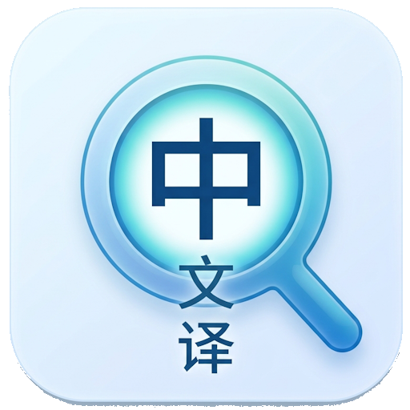
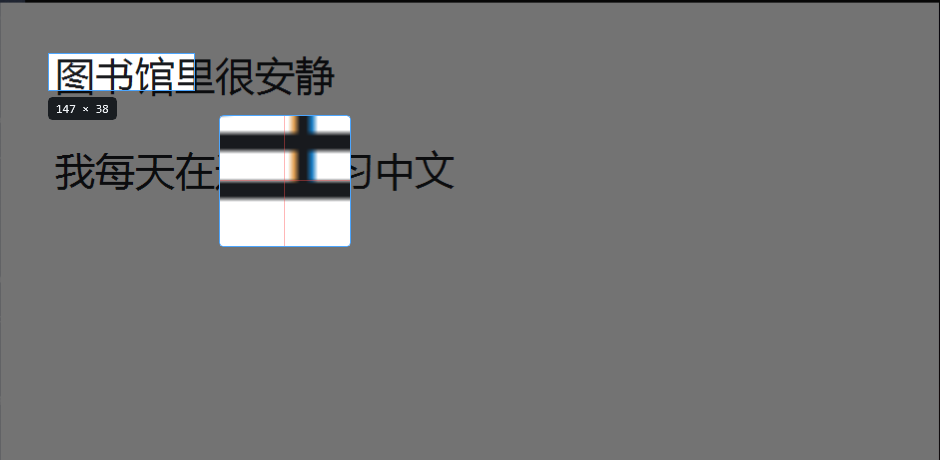
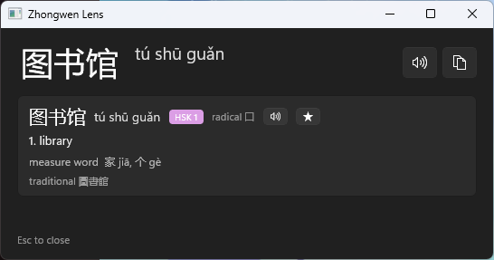
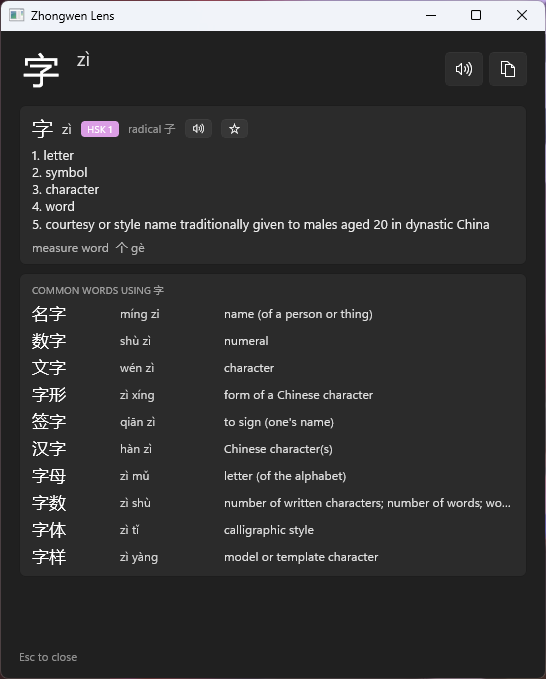
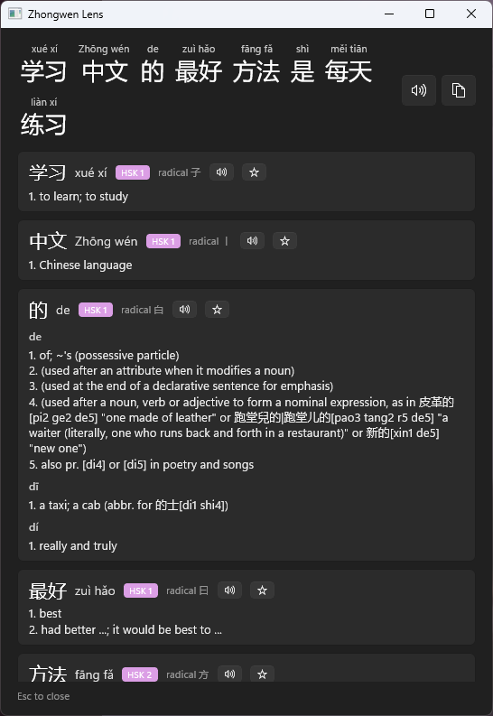

# Zhongwen Lens

**a snipping tool for reading Chinese.** you can simply press a hotkey, drag a box over any Chinese text on
screen, and get it back with pinyin, dictionary meanings and speech.

---

## what it does

Chinese is hard to look up. you can't type a character you don't know, and copying text out of a
game, a PDF, or a video subtitle usually isn't possible at all. Zhongwen Lens reads it off the
screen instead.

press **`Ctrl+Alt+Z`**, drag over the text, and the reading appears under your selection.

## features

- **snip anything on screen.** Capture goes through DXGI Desktop Duplication, so it reads
  fullscreen games and hardware-decoded video, not just ordinary windows.
- **built for characters and short words.** A one-word snip takes a fast path that skips text
  detection entirely — more accurate at that size, and about four times quicker.
- **every reading, not just one.** 行 is xíng, háng *and* hàng. The app shows all of them rather
  than silently picking one and teaching you the wrong pronunciation.
- **real idiom meanings.** 马马虎虎 resolves to "careless; casual; so-so", not four separate
  character definitions.
- **pinyin that's actually correct.** Readings come from the dictionary entry, so 银行 is
  *yín háng*, never *yín xíng*.
- **speak it aloud.** Offline text-to-speech for the whole selection or any single word.
- **HSK levels, radicals, and measure words** on every card.
- **single-character view** additionally shows the common words that use that character.
- **save words** with the sentence you met them in, and export to Anki.
- **rebindable hotkey**, optional start-with-Windows, and layout/script preferences.
- **works offline, permanently.** The dictionary and OCR models ship with the app. Nothing is
  ever sent anywhere.

## Screenshots

| A word | A single character |
|:--:|:--:|
|  |  |
| Pinyin beside the text, HSK band, radical, measure word, and ☆ to save it. | Every sense, plus the common words that use the character. |

## Install

download the latest `.msi` from the [**Releases**](../../releases) page and double-click it.

that's it. no administrator rights, no certificates, nothing else to install: it installs just
for you, and the app carries its own .NET and Windows App SDK runtimes.

> **"Windows protected your PC"** — the installer isn't code-signed, because a certificate costs
> a few hundred dollars a year and this is a free project. click **more info** then **run
> anyway**. if you'd rather not take my word for it, [build it yourself](CONTRIBUTING.md); the
> installer is produced by `scripts/package-msi.ps1` from the source in this repo.

uninstall from **Settings → Apps → Installed apps** like anything else. your saved words are
kept — they live in `%LOCALAPPDATA%\ZhongwenLens`, separate from the app itself, so an uninstall
or upgrade never touches them.

**requirements:** Windows 11 (or Windows 10 2004+), x64. for speech, a Chinese voice: Windows
ships *Microsoft Huihui* by default.

## using it

| | |
|---|---|
| **`Ctrl+Alt+Z`** | Snip. Drag over Chinese text. Rebindable. |
| **`Esc`** | Cancel the snip, or close the result. |
| **Tray icon** | Left-click to snip; right-click for saved words, settings and exit. |

> **can't find the tray icon?** Windows 11 hides new ones by default. Click the `^` chevron on
> the taskbar to see it, or pin it permanently under **Settings → Personalisation → Taskbar →
> Other system tray icons**.

### settings

right-click the tray icon → **Settings…**

- **snip hotkey** — rebind it to anything with Ctrl, Alt, Shift or Win. if the combination is
  already taken by another app the change is refused and your old one stays working.
- **start when I sign in**
- **pinyin placement** — beside the text, above each word, or automatic (beside for short
  selections, above for long ones)
- **dictionary cards lead with** simplified or traditional
- **speak automatically after each snip**

changes apply immediately, and are stored in `%LOCALAPPDATA%\ZhongwenLens\settings.json` — the
same place as your saved words, so they survive upgrades and uninstalls.

### saved words and Anki

click **☆** on any card to save a word along with the sentence it came from. Right-click the tray
icon → **Saved words…** to review them and **Export for Anki**.

in Anki: *File → Import*, pick the exported file, then choose your note type. the columns are
simplified, Pinyin, Meaning, Context, HSK, Traditional, MeasureWord, and the file carries Anki's
own import directives so nothing needs configuring.

## limitations

- **DRM-protected video captures black**
- **No sentence translation.**
- **HSK coverage is partial.**
- **Handwriting and photographs**

## Building from source

See [**CONTRIBUTING.md**](CONTRIBUTING.md).

## credits

built on [CC-CEDICT](https://www.mdbg.net/chinese/dictionary?page=cc-cedict) (CC BY-SA 4.0),
[PaddleOCR](https://github.com/PaddlePaddle/PaddleOCR) (Apache 2.0),
[jieba](https://github.com/fxsjy/jieba)'s frequency data (MIT), and
[complete-hsk-vocabulary](https://github.com/drkameleon/complete-hsk-vocabulary) (MIT).
